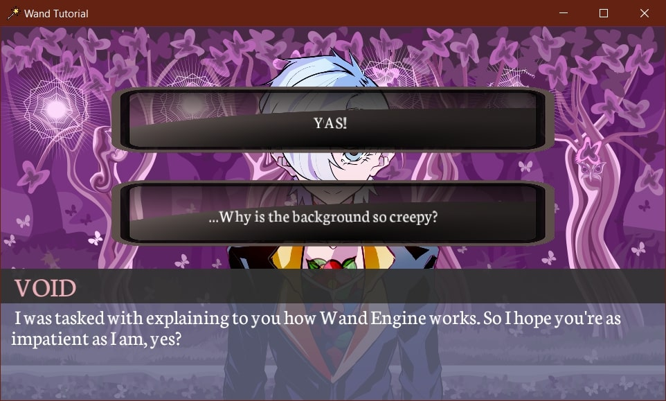

# Wand Engine

This simple engine can be used for the development of 2D games, especially visual novels. Written in C++ and developed in Visual Studio, its applications can run on Windows x64 platforms.

Here is a screenshot of [Wand Tutorial](https://github.com/mariaviolaki/wand-tutorial), an example game made with this engine:

## Project Dependencies

* Windows SDK Version >= 10.0
* Platform Toolset >= Visual Studio 2022
* C++ Language Standard >= ISO C++20 Standard
* C Language Standard >= ISO C17 (2018) Standard

External libraries and frameworks:
* OpenGL: graphics rendering
* Glad: OpenGL initialization
* GLFW: window creation and management
* GLM: mathematics for OpenGL
* nlohmann/json: JSON serialization
* stb_image: image loading
* FreeType: font rendering
* SoLoud: audio playback

## Project Details

The Visual Studio solution contains 2 different projects, each of them in its own separate folder:
* Wand: Project including all the engine code.
* Game: Project intended for the game developer. Includes code, assets, and game states.

The engine offers features such as the following:
* Handling user input, such as mouse and keyboard presses
* Positioning game entities relative to their layouts
* Rotating and flipping game entities
* Playing music and sound effects
* Saving states, consisting of name-value pairs, into a file
* Grouping together different sprites for the same character
* Loading assets, such as audio and fonts
* Generating random integers and floats within a certain range
* Setting the window's title, size, icon, fullscreen mode, and aspect ratio
* Creating custom cursors by providing an image
* Setting depth layers to determine which entities will be rendered in front of others
* Setting functions that run before the window closes or when the user interacts with a UI entity
* Other utility functions, such as easily converting a string to uppercase